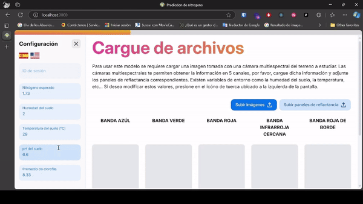
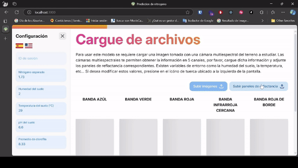
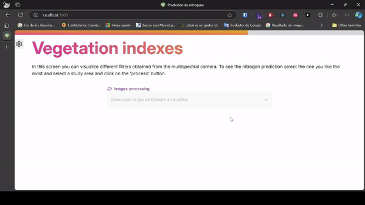
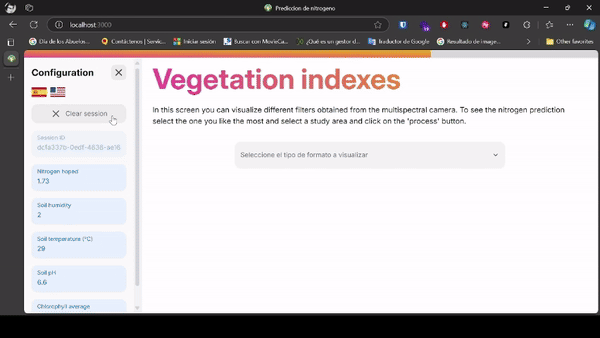
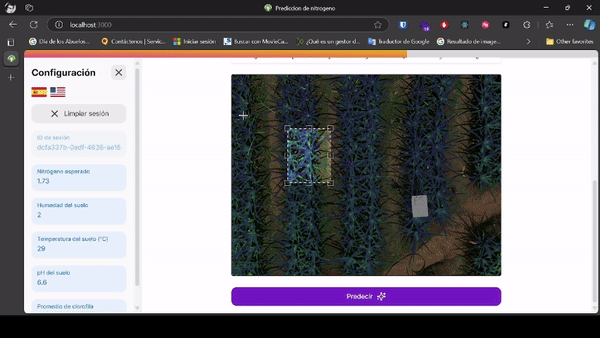

# NitrogenAI Prediction

NitrogenAI Prediction es una app que, usando imágenes multiespectrales (nir, red, blue, green, red edge) y datos IoT como humedad, pH, temperatura del suelo y clorofila, predice el nitrógeno en cultivos de piña, ayudando a los agricultores a optimizar su manejo y reducir costos sin necesidad de análisis de laboratorio.

## Features

✨ Pensado para ser usado en distintas partes del mundo!

✨ Soporte para formato de imágenes .tif

✨ Permite revisar indices (filtros) a partir de las imágenes progresivamente mientras termina de procesar la información

✨ Reconoce la sesion en la que estás y permite recuperar el procesamiento de la imágen que ya has cargado

✨ Permite seleccionar un área y predecir el nivel de nitrogeno

## Tecnologías usadas

Usamos el siguiente stack para poder culminar este proyecto

-   Remix -- Frontend (React) Framework: Nos permitió levantar un proyecto de forma rápida y agregar las funcionalidades mencionadas arriba.
-   Flask -- Python Framework: Nos permitió utilizar el modelo preentrenado y trabajar todo el poder de computo que necesitaba el procesamiento de imágenes.
-   Docker: Fue de gran ayuda ya que las dependencias que necesita el modelo de IA para funcionar son muy especificas y poco documentas. Por lo que fue crucial tener un docker con la declaración del despliegue.

## Ver más

Si deseas ver como fue construido el backend revisa el github [clic aquí](https://github.com/rdzPedraos/NitrogenPrediction-back)
